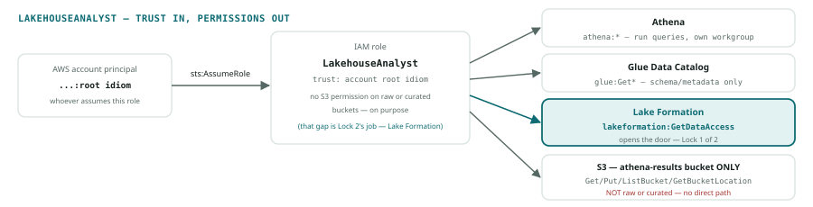
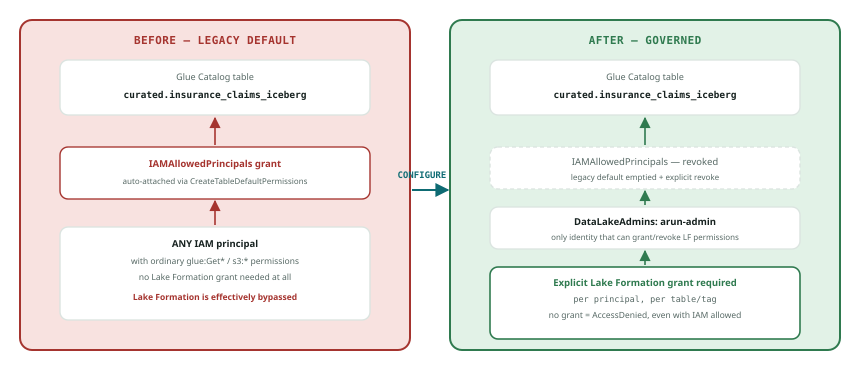
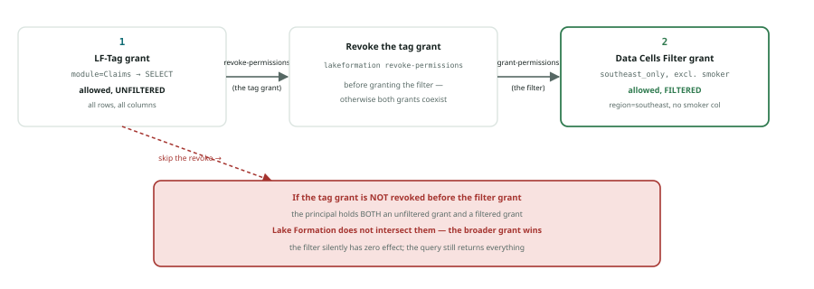
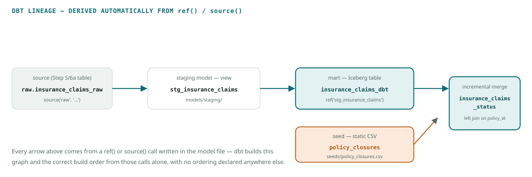

# AWS Lakehouse: Lake Formation + Athena + dbt (CLI-only build)

A hands-on build of a governed data lakehouse on AWS, done entirely from the command line: S3 for storage, the Glue Data Catalog as the shared metastore, Apache Iceberg for ACID table format, AWS Lake Formation for fine-grained governance, Amazon Athena as the query engine, and dbt for the transformation layer on top. Every command below is copy-pasteable; the exact JSON, SQL, and dbt files referenced throughout live in this repo.

This is a build log, not a tutorial — it assumes you already know what an IAM role, a policy, and a grant are, and gets straight to the commands and the specific decisions behind them.

## Stack

| Layer | Tool |
|---|---|
| Storage | S3 (raw / curated / consumption zones) |
| Metastore | AWS Glue Data Catalog |
| Table format | Apache Iceberg |
| Governance | AWS Lake Formation |
| Query engine | Amazon Athena |
| Transformation layer | dbt (`dbt-athena-community`) |

**Prerequisites:** an AWS account, the AWS CLI configured with a profile that has admin rights for setup, `jq`, and Python 3 for dbt. Every command assumes `export AWS_PROFILE=<your-profile>` is already set, and that `ACCOUNT_ID` and `REGION` below are replaced with your own account ID (`aws sts get-caller-identity`) and region.

**Naming convention:** S3 bucket names are globally unique, so every command uses `arun-lakehouse-*` as a stand-in — swap in your own prefix.

## Architecture

```
raw zone (S3) → curated zone — Iceberg table (Athena CTAS) → Glue Data Catalog
Lake Formation grant → Athena (analyst role) → filtered result set
dbt models → compiled SQL → Athena → same Iceberg tables, tested + documented
```

Lake Formation isn't a separate service sitting off to the side — it's a second, independent authorization layer built directly into the Glue Data Catalog, present whether you configure it or not. The centerpiece of this build is what's usually called the **two-lock model**: a query has to clear both an IAM check and a separate Lake Formation check to succeed. The middle section below sets that up, then deliberately fails the check and fixes it, so the mechanism is provable rather than just described.

## 1. S3 zones and the analyst IAM role

Three S3 buckets, one per zone (`raw`, `curated`, `consumption`), plus a results bucket for Athena. Then one IAM role representing a person querying through Athena — `LakehouseAnalyst`. It deliberately gets **no** direct S3 permission on the data buckets; under Lake Formation, access is supposed to come from a Lake Formation grant handing out temporary credentials, not from the IAM policy alone. That gap is what section 3 below proves.

Policy files: [`iam-policies/analyst-trust-policy.json`](iam-policies/analyst-trust-policy.json), [`iam-policies/analyst-policy.json`](iam-policies/analyst-policy.json).

```bash
aws iam create-role --role-name LakehouseAnalyst \
  --assume-role-policy-document file://iam-policies/analyst-trust-policy.json

aws iam put-role-policy --role-name LakehouseAnalyst \
  --policy-name lakehouse-analyst-access \
  --policy-document file://iam-policies/analyst-policy.json
```



*The role's trust policy (who may assume it) and permissions policy (what it may then do) split apart deliberately: nothing in the permissions policy reaches the raw or curated S3 buckets directly. That's not an oversight — it's the gap a Lake Formation grant fills in section 3.*

## 2. Databases, workgroup, and the curated Iceberg table

Create one Glue database per zone, an Athena workgroup for query results, and land a source CSV in the raw zone:

```bash
aws glue create-database --database-input '{"Name":"raw"}'
aws glue create-database --database-input '{"Name":"curated"}'
aws glue create-database --database-input '{"Name":"consumption"}'

aws athena create-work-group --name analytics-prod \
  --configuration '{
    "ResultConfiguration": { "OutputLocation": "s3://arun-lakehouse-athena-results/" },
    "EnforceWorkGroupConfiguration": true,
    "PublishCloudWatchMetricsEnabled": true
  }'
```

Register the raw CSV as a table (Glue crawler or a hand-written `CREATE EXTERNAL TABLE` both work — either way, once it's catalogued), then rebuild it as a partitioned, ACID-transactional Iceberg table sitting on Parquet, in one statement ([`sql/01_curated_table_ctas.sql`](sql/01_curated_table_ctas.sql)):

```sql
CREATE TABLE curated.insurance_claims_iceberg
WITH (
  table_type = 'ICEBERG',
  is_external = false,
  location = 's3://arun-lakehouse-curated/insurance_claims_iceberg/',
  partitioning = ARRAY['region']
) AS
SELECT ROW_NUMBER() OVER () AS policy_id, *
FROM raw.insurance_claims_raw;
```

Every Iceberg table exposes read-only pseudo-tables for inspecting its own metadata with plain SQL — no reaching into the raw JSON/Avro metadata files yourself ([`sql/02_iceberg_metadata_queries.sql`](sql/02_iceberg_metadata_queries.sql)):

```sql
SELECT * FROM "curated"."insurance_claims_iceberg$partitions";
SELECT * FROM "curated"."insurance_claims_iceberg$files";
SELECT * FROM "curated"."insurance_claims_iceberg$manifests";
SELECT * FROM "curated"."insurance_claims_iceberg$snapshots";
```

## 3. Configure Lake Formation, then prove the two-lock model

Nothing gets *created* here — Lake Formation is already wired into the Glue Catalog. New databases inherit a legacy `IAMAllowedPrincipals` grant by default that quietly lets any IAM principal with Glue/S3 permissions read everything, bypassing Lake Formation's own check entirely. Turn that off account-wide, clean up the databases created above (the setting change isn't retroactive), then tag the curated database — without granting the analyst role anything yet:

```bash
aws lakeformation put-data-lake-settings --data-lake-settings '{
    "DataLakeAdmins": [{ "DataLakePrincipalIdentifier": "arn:aws:iam::ACCOUNT_ID:user/YOUR_USERNAME" }],
    "CreateDatabaseDefaultPermissions": [],
    "CreateTableDefaultPermissions": []
  }'

# register the curated bucket so Lake Formation can vend scoped credentials for it
aws lakeformation register-resource \
  --resource-arn arn:aws:s3:::arun-lakehouse-curated \
  --use-service-linked-role

# the databases above predate the setting change — strip their legacy grant explicitly
aws lakeformation revoke-permissions \
  --principal DataLakePrincipalIdentifier=IAM_ALLOWED_PRINCIPALS \
  --resource '{"Table": {"DatabaseName": "curated", "Name": "insurance_claims_iceberg"}}' \
  --permissions ALL

# an LF-Tag: grant SELECT on anything tagged module=Claims, not just this one table by name
aws lakeformation create-lf-tag --tag-key module --tag-values Claims Underwriting

aws lakeformation add-lf-tags-to-resource \
  --resource '{"Database": {"Name": "curated"}}' \
  --lf-tags '[{"TagKey": "module", "TagValues": ["Claims"]}]'
```

> **The single most common Lake Formation gotcha:** skip the `IAM_ALLOWED_PRINCIPALS` revoke, and every grant or filter below will appear to do nothing — the legacy grant is already letting everyone in underneath whatever Lake Formation says. First thing to check any time an LF permission "isn't working."



Now prove it. Assume `LakehouseAnalyst` — with an IAM policy that allows Athena but no Lake Formation grant on the curated data yet — and try a query:

```bash
aws sts assume-role \
  --role-arn arn:aws:iam::ACCOUNT_ID:role/LakehouseAnalyst \
  --role-session-name lf-test > analyst-creds.json

export AWS_ACCESS_KEY_ID=$(jq -r '.Credentials.AccessKeyId' analyst-creds.json)
export AWS_SECRET_ACCESS_KEY=$(jq -r '.Credentials.SecretAccessKey' analyst-creds.json)
export AWS_SESSION_TOKEN=$(jq -r '.Credentials.SessionToken' analyst-creds.json)

aws athena start-query-execution \
  --work-group analytics-prod \
  --query-execution-context Database=curated \
  --query-string "SELECT * FROM insurance_claims_iceberg LIMIT 5"
```

**Expected: `FAILED`, `AccessDenied`.** IAM said yes, Lake Formation said no, and no said no — the two-lock model working correctly.

**3a — unlock it with the LF-Tag.** Back on admin credentials:

```bash
unset AWS_ACCESS_KEY_ID AWS_SECRET_ACCESS_KEY AWS_SESSION_TOKEN

aws lakeformation grant-permissions \
  --principal '{"DataLakePrincipalIdentifier": "arn:aws:iam::ACCOUNT_ID:role/LakehouseAnalyst"}' \
  --permissions SELECT \
  --resource '{"LFTagPolicy": {"ResourceType": "TABLE", "Expression": [{"TagKey": "module", "TagValues": ["Claims"]}]}}'
```

Retry the same query as the analyst: it now succeeds, and returns every column and every region — a working, unfiltered LF-Tag grant.

**3b — swap it for row + column filtering.** A real analyst usually shouldn't see everything. Back on admin credentials, revoke the tag grant first, then grant a scoped data cells filter instead:

```bash
aws lakeformation revoke-permissions \
  --principal '{"DataLakePrincipalIdentifier": "arn:aws:iam::ACCOUNT_ID:role/LakehouseAnalyst"}' \
  --permissions SELECT \
  --resource '{"LFTagPolicy": {"ResourceType": "TABLE", "Expression": [{"TagKey": "module", "TagValues": ["Claims"]}]}}'

aws lakeformation create-data-cells-filter --table-data '{
    "TableCatalogId": "ACCOUNT_ID",
    "DatabaseName": "curated",
    "TableName": "insurance_claims_iceberg",
    "Name": "southeast_only",
    "RowFilter": { "FilterExpression": "region = '"'"'southeast'"'"'" },
    "ColumnWildcard": { "ExcludedColumnNames": ["smoker"] }
  }'

aws lakeformation grant-permissions \
  --principal '{"DataLakePrincipalIdentifier": "arn:aws:iam::ACCOUNT_ID:role/LakehouseAnalyst"}' \
  --permissions SELECT \
  --resource '{"DataCellsFilter": {"TableCatalogId": "ACCOUNT_ID", "DatabaseName": "curated", "TableName": "insurance_claims_iceberg", "Name": "southeast_only"}}'
```

> **Why revoke the tag grant first:** Lake Formation doesn't intersect an unfiltered grant with a filtered one. If a principal holds both, the broader, unfiltered grant wins and the filter is silently ignored. Grant exactly one per principal per table.

Retry the query again: it succeeds, but every row shows `region = southeast` and there's no `smoker` column at all — IAM allowed the call, Lake Formation vended scoped, filtered access, and Athena never touched the raw table directly.



## 4. Iceberg operations

Back on admin credentials, against `curated.insurance_claims_iceberg` — the operations that separate a lakehouse table from a plain data lake file. Full statements in [`sql/03_schema_evolution_time_travel.sql`](sql/03_schema_evolution_time_travel.sql), [`sql/04_merge_into_upsert.sql`](sql/04_merge_into_upsert.sql), and [`sql/05_optimize_vacuum.sql`](sql/05_optimize_vacuum.sql).

**Schema evolution + time travel, no rewrite required:**

```sql
ALTER TABLE curated.insurance_claims_iceberg
ADD COLUMNS (policy_status string);

SELECT * FROM curated.insurance_claims_iceberg
FOR TIMESTAMP AS OF TIMESTAMP '2026-09-01 00:00:00 UTC';
```

**`MERGE INTO` — an upsert without a full rewrite:**

```sql
MERGE INTO curated.insurance_claims_iceberg t
USING curated.claims_updates s ON t.policy_id = s.policy_id
WHEN MATCHED THEN UPDATE SET policy_status = s.policy_status
WHEN NOT MATCHED THEN INSERT (policy_id, policy_status)
  VALUES (s.policy_id, s.policy_status);
```

**Maintenance, and the retention tradeoff:**

```sql
OPTIMIZE curated.insurance_claims_iceberg REWRITE DATA USING BIN_PACK;
VACUUM curated.insurance_claims_iceberg;
```

`VACUUM` respects two retention settings — Athena's defaults, if unset, keep any snapshot newer than 5 days and at least the 1 most recent snapshot regardless of age. Set your own window with table properties:

```sql
ALTER TABLE curated.insurance_claims_iceberg SET TBLPROPERTIES (
  'vacuum_max_snapshot_age_seconds'='2592000',
  'vacuum_min_snapshots_to_keep'='5'
);
```

Longer retention means more time-travel range and a bigger audit/rollback window, at the cost of more S3 storage held as superseded data. Shorter retention keeps storage lean but `FOR TIMESTAMP AS OF` against anything past the cutoff simply won't find a matching snapshot.

## 5. The transformation layer: dbt

The CTAS and `MERGE INTO` above were both correct, hand-run SQL — but nothing tracked that `insurance_claims_dbt` depends on the raw table, nothing tested that `policy_id` stayed unique after a merge, and nothing documented the pipeline. dbt is what production teams layer on top of exactly this kind of SQL for dependency tracking, automated tests, and generated documentation — without adding a new compute engine. Every model still compiles to SQL that runs through Athena.

Full project in [`dbt/`](dbt/).

**Install and connect:**

```bash
pip install dbt-core dbt-athena-community
```

`dbt` needs its own role — `LakehouseAnalyst` is deliberately read-only. Policy files: [`iam-policies/dbt-trust-policy.json`](iam-policies/dbt-trust-policy.json), [`iam-policies/dbt-policy.json`](iam-policies/dbt-policy.json).

```bash
aws iam create-role --role-name LakehouseDbt \
  --assume-role-policy-document file://iam-policies/dbt-trust-policy.json

aws iam put-role-policy --role-name LakehouseDbt \
  --policy-name lakehouse-dbt-access \
  --policy-document file://iam-policies/dbt-policy.json

aws lakeformation grant-permissions \
  --principal '{"DataLakePrincipalIdentifier": "arn:aws:iam::ACCOUNT_ID:role/LakehouseDbt"}' \
  --permissions CREATE_TABLE ALTER DESCRIBE \
  --resource '{"Database": {"Name": "curated"}}'
```

A principal with `CREATE_TABLE` on a database automatically becomes the owner of — and gets full permissions on — any table it creates, so this one grant covers everything dbt is about to build.

```bash
aws sts assume-role \
  --role-arn arn:aws:iam::ACCOUNT_ID:role/LakehouseDbt \
  --role-session-name dbt-run > dbt-creds.json

export AWS_ACCESS_KEY_ID=$(jq -r '.Credentials.AccessKeyId' dbt-creds.json)
export AWS_SECRET_ACCESS_KEY=$(jq -r '.Credentials.SecretAccessKey' dbt-creds.json)
export AWS_SESSION_TOKEN=$(jq -r '.Credentials.SessionToken' dbt-creds.json)
```

Copy [`dbt/profiles.yml.example`](dbt/profiles.yml.example) to `~/.dbt/profiles.yml`, fill in `REGION` and your bucket names. No access key goes in the profile — dbt picks up the credentials already exported above. `dbt debug` should print `All checks passed!` before writing a single model.

**Models, tests, and a seed** — [`dbt/models/staging/stg_insurance_claims.sql`](dbt/models/staging/stg_insurance_claims.sql), [`dbt/models/marts/insurance_claims_dbt.sql`](dbt/models/marts/insurance_claims_dbt.sql), [`dbt/models/marts/insurance_claims_status.sql`](dbt/models/marts/insurance_claims_status.sql):

```bash
# leading + pulls in everything upstream, not just this one model
dbt run --select +insurance_claims_dbt
dbt test --select insurance_claims_dbt

dbt seed
dbt run --select insurance_claims_status
dbt run --select insurance_claims_status   # second run MERGEs instead of rebuilding
```

> **Iceberg `merge` needs Athena engine v3.** Check with `aws athena get-work-group --work-group analytics-prod --query 'WorkGroup.Configuration.EngineVersion'` — new workgroups default to v3.

**Docs and lineage, generated for free:**

```bash
dbt docs generate
dbt docs serve --port 8081
```



This graph — `insurance_claims_raw → stg_insurance_claims → insurance_claims_dbt → insurance_claims_status`, plus the `policy_closures` seed — comes entirely from the `ref()` and `source()` calls in the model files above. No ordering is declared anywhere else; dbt derives both the build order and this picture from the same references.

## Troubleshooting notes from the actual build

- **`aws lakeformation list-permissions` requires `--resource` whenever `--principal` is set** — e.g. `--resource '{"Database": {"Name": "curated"}}'`. Easy to miss since most other `list-*` commands don't need it.
- **Missing `s3:GetBucketLocation`** on the analyst/dbt policies produces a confusing Athena failure that looks like a permissions problem elsewhere — it's specifically needed alongside `GetObject`/`PutObject`/`ListBucket` on the results bucket.
- **`dbt run --select <model>` does not auto-include upstream `ref()`'d dependencies.** Without the leading `+` (`+insurance_claims_dbt`), a model with unbuilt dependencies fails with a table-not-found error from Athena, not a dbt-level error — worth knowing before you go looking in the wrong place.
- **`python3 -m dbt` does not work.** `dbt-core` ships no `__main__.py`, so this fails with `No module named dbt.__main__`. If `dbt` isn't found after `pip install`, it's almost always a `PATH` issue from installing outside a virtualenv — create and activate one (`python3 -m venv .venv && source .venv/bin/activate`), confirm with `which python3` that it points into the venv, then use the plain `dbt` command.

## Cleanup

Nothing here runs continuously, but roles, buckets, and grants left behind quietly turn into a monthly line item.

```bash
# Lake Formation — revoke grants and tag associations first, or the deletes below can fail
aws lakeformation revoke-permissions \
  --principal '{"DataLakePrincipalIdentifier": "arn:aws:iam::ACCOUNT_ID:role/LakehouseAnalyst"}' \
  --permissions SELECT \
  --resource '{"DataCellsFilter": {"TableCatalogId": "ACCOUNT_ID", "DatabaseName": "curated", "TableName": "insurance_claims_iceberg", "Name": "southeast_only"}}'

aws lakeformation delete-data-cells-filter \
  --table-catalog-id ACCOUNT_ID --database-name curated \
  --table-name insurance_claims_iceberg --name southeast_only

aws lakeformation revoke-permissions \
  --principal '{"DataLakePrincipalIdentifier": "arn:aws:iam::ACCOUNT_ID:role/LakehouseDbt"}' \
  --permissions CREATE_TABLE ALTER DESCRIBE \
  --resource '{"Database": {"Name": "curated"}}'

aws lakeformation remove-lf-tags-from-resource \
  --resource '{"Database": {"Name": "curated"}}' \
  --lf-tags '[{"TagKey": "module", "TagValues": ["Claims"]}]'

aws lakeformation delete-lf-tag --tag-key module
aws lakeformation deregister-resource --resource-arn arn:aws:s3:::arun-lakehouse-curated

# Glue
aws glue delete-database --name raw
aws glue delete-database --name curated
aws glue delete-database --name consumption

# Athena
aws athena delete-work-group --work-group analytics-prod --recursive-delete-option

# IAM
aws iam delete-role-policy --role-name LakehouseAnalyst --policy-name lakehouse-analyst-access
aws iam delete-role --role-name LakehouseAnalyst
aws iam delete-role-policy --role-name LakehouseDbt --policy-name lakehouse-dbt-access
aws iam delete-role --role-name LakehouseDbt

# S3 — empty each bucket first, then delete it
for b in raw curated consumption athena-results; do
  aws s3 rm s3://arun-lakehouse-$b --recursive
  aws s3 rb s3://arun-lakehouse-$b
done
```

## What's next

This repo intentionally stops at Lake Formation + Athena + dbt so it stays a clean, CLI-only story. Two things are cut from this version on purpose, and both are coming back as separate additions so the repo keeps growing rather than getting rewritten:

- **Amazon Redshift Spectrum** — proving the same Lake Formation grant governs a second, completely different query engine reading the same Iceberg table through the same Glue Catalog. No changes to any of the governance above; just a second entry point into it.
- **Infrastructure as code** — rebuilding this same architecture in Terraform, once the manual, CLI-first version above is solid.
